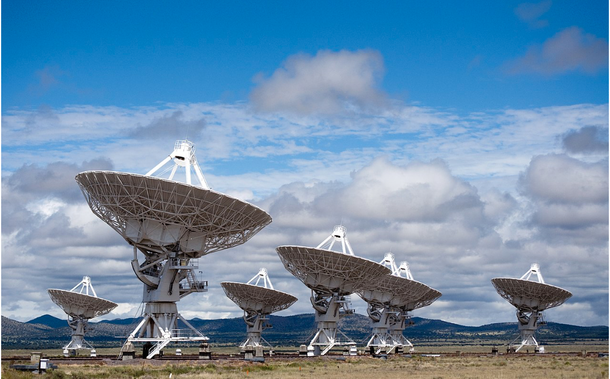

# EEC130AB - Electromagnetics
This repository contains lecture notes of the EEC130 series from the University of California, Davis. The series covers the theoretical foundations behind Electromagnetism. It is important for Electrical Engineering students who want to go into the Radio Frequency sub-field.

## Course Content
### EEC130A
* [Transmission Line Basics](./lecture/Transmission_Line.md)
* [Electrostatics](./lecture/Electrostatics.md)
* [Magnetostatics](./lecture/Magnetostatics.md)
* [Electrodynamics and Maxwell's Equations](./lecture/Electrodynamics.md)

### EEC130B
* [Electromagnetic Uniform Plane Wave Propagation](./lecture/Electromagnetic_Wave_Propagation.md)
* [Reflection and Transmission](./lecture/Reflection_and_transmission.md)
* [Waveguides](./lecture/Waveguides.md)

## Why Study Electromagnetics?
* With knowledge of electric and magnetic fields, we can store and process information and energy.
* With knowledge of electromagnetic waves, we can transmit information and energy.

## Course Review
* Professor Putnam is a great lecturer. He focuses on developing a deep understanding of the concept.
* EEC130A was more conceptual and similar to Intro E&M in an undergraduate physics class. However, it also includes the study of the transmission line, which is interesting because we've never thought of a circuit that would have a signal delay.
* EEC130B was more formula-heavy because we studied the solutions to wave PDEs derived from Maxwell's Equations. We also studied waveguides, but it also involved lots of wave solutions and facts to memorize.
* Overall, I'll give 130A a 5/5 and 130B a 3/5.

## Reference
* This is the note that I took while taking Professor **William Putnam**'s EEC130AB courses at UC Davis in the Winter/Spring Quarter of 2024. 
You can see the detailed course description at [https://ece.ucdavis.edu/course-catalog](https://ece.ucdavis.edu/course-catalog).
* In this course, we used the following textbook: **Fundamentals of Applied Electromagnetics by Fawwaz T. Ulaby and Umberto Ravaioli, 8th Edition, Pearson, 2020.**
* Some images in this GitHub come from the lecture notes of Professor Putnam or the textbook.