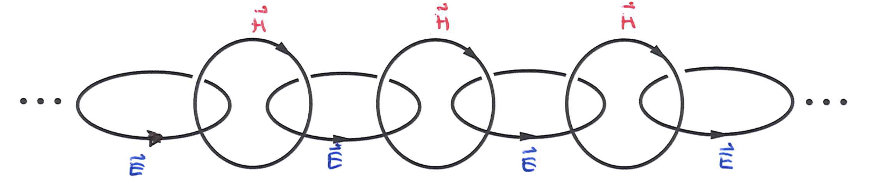
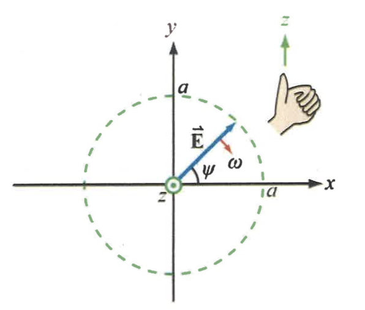
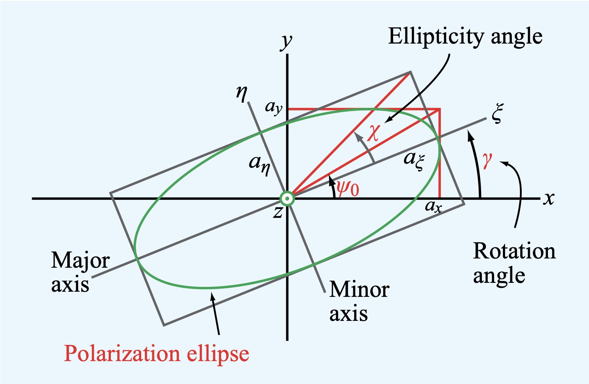

# Electromagnetic Wave Propagation

In the transmission line section, we looked at wave propagation in 1 spatial coordinate. Here, we will build on our knowledge of Maxwell's Equation and model the EM wave propagating in any direction.

## 1. Maxwell's Equation

**Integral Form**

$$\oint \vec{E} \cdot d\vec{A} = \frac{Q_{enclosed}}{\epsilon}$$

$$\oint \vec{E} \cdot d\vec{l} = -\frac{d\phi_B}{dt}$$

$$\oint \vec{B} \cdot d\vec{A} = 0$$

$$\oint \vec{B} \cdot d\vec{l} = \mu i + \mu \epsilon \frac{d \phi_E}{dt}$$

**Differential Form**

$$\vec{\nabla} \cdot \vec{E} = \frac{\rho}{\epsilon}$$

$$\vec{\nabla} \times \vec{E} = -\mu \frac{\partial \vec{H}}{\partial t}$$

$$\vec{\nabla} \cdot \vec{H} = 0$$

$$\vec{\nabla} \times \vec{H} = \epsilon \frac{\partial \vec{E}}{\partial t}$$

where $\mu_0 \epsilon_0 \frac{d \phi_E}{dt}$ is the displacement current.

**Intuition**: If we only look at the dynamic equations, the time-varying B field induces the circulating E field. Time-varying E field induces circulating B field.

## 2. Uniform Plane Wave Solution

Assume $\vec{E} = E_x(z, t) \hat{x}$ and $\vec{H} = H_y(z, t) \hat{y}$, so they are constant in planes of constant z with medium $\epsilon$ and $\mu$.

We  will get 

$$\vec{\nabla} \times \vec{E} = \frac{\partial{E_x}}{\partial z} \hat{y} $$

$$\vec{\nabla} \times \vec{H} = -\frac{\partial H_y}{\partial z}\hat{x}$$

If we plug these into the source-free vacuum equations, we will eventually get

$$\frac{\partial E_x}{\partial z} = -\mu \frac{\partial H_y}{\partial t}$$

$$\frac{\partial H_y}{\partial z} = -\epsilon \frac{\partial E_x}{\partial t}$$

they are very similar to the transmission line equation.

Furthermore, we could manipulate the equations into two **wave equations**. For example, 

$$
\begin{align}
& \frac{\partial E_x}{\partial z} = -\mu \frac{\partial H_y}{\partial t} \\
& \implies \frac{\partial}{\partial z}\frac{\partial E_x}{\partial z} = -\mu \frac{\partial}{\partial z}\frac{\partial H_y}{\partial t} \\
& \implies \frac{\partial^2 E_x}{\partial z^2} = -\mu \frac{\partial}{\partial t}\frac{\partial H_y}{\partial z} \\
& \implies \frac{\partial^2 E_x}{\partial z^2} = \mu \epsilon \frac{\partial^2 E_x}{\partial t^2}\\
\end{align}
$$

The phase velocity (**speed of light**) is $\frac{1}{\sqrt{\mu \epsilon}}$, which is parallel to $\frac{1}{\sqrt{L' C'}}$ from the transmission line.

The solution to this wave equation is 

$$E_x = E_0 cos(\omega t - k z)$$

$$H_y = \frac{E_0}{\eta} cos(\omega t - k z)$$

k is the wave number, $\frac{2 \pi}{\lambda}$

### Intrinsic Impedance

The Intrinsic Impedance relates the magnitude of E field to B field, just like the Characteristic Impedance relates the voltage and the current.

$$\eta = \sqrt{\frac{\mu}{\epsilon}}$$

where $\mu$ is the magnetic constant and $\epsilon$ is the electric constant,

and 

$$|\vec{E_x}| = \eta |\vec{H_y}| $$

In vacuum, 

$$\eta_0 = \sqrt{\frac{\mu_0}{\epsilon_0}} = 377 \space \Omega$$

### Parallel Between the Transmission Line to Free Space

1-D Voltage and Current waves now turn to Electric and Magnetic field waves.

$$v(z, t) \implies \vec{E}(x, y, z, t)$$

$$i(z, t) \implies \vec{H}(x, y, z, t)$$

In source free ($\rho = 0, \vec{J} = 0$) vacuum, we have 

$$\vec{\nabla} \times \vec{E} = -\mu_0 \frac{\partial \vec{H}}{\partial t}$$

$$\vec{\nabla} \times \vec{H} = \epsilon_0 \frac{\partial \vec{E}}{\partial t}$$

which parallels to the lossless voltage and current PDE seen in the transmission line section, where

$$\frac{\partial v(z, t)}{\partial z} = - L'\frac{d i(z, t)}{d t}$$

$$\frac{\partial i(z, t)}{\partial z} = - C' \frac{dv(z, t)}{dt}$$

## 3. Phasors and Maxwell's Equations

### Maxwell's Equations in Phasor Domain

If the time variation of the E and B field is sinusoidal with frequency $\omega$, then we can write the E and B field as:

$$\vec{E}(x, y, z, t) = Re{ \widetilde{\mathbf{E}}(x, y, z) e^{j \omega t}}$$

$$\vec{E}(x, y, z, t) = \text{Re} \\{ \widetilde{\mathbf{E}}(x, y, z) e^{j \omega t}\\}$$

$$\vec{H}(x, y, z, t) = \text{Re} \\{ \widetilde{\mathbf{H}}(x, y, z) e^{j \omega t}\\}$$

where $\bold{\vec{E}}$ and $\bold{\vec{H}}$ are the E and B field phasors with vector quantity.

We can put the source-free Maxwell's Equation into the phasor domain by swapping the time derivatives with $j \omega$ and vectors with phasors.
<!-- Change -->
$$\vec{\nabla} \cdot \bold{\vec{E}} = 0$$

$$\vec{\nabla} \times \bold{\vec{E}} = -\mu j\omega \bold{\vec{H}}$$

$$\vec{\nabla} \cdot \bold{\vec{H}} = 0$$

$$\vec{\nabla} \times \bold{\vec{H}} = \epsilon j\omega \bold{\vec{E}}$$

### Plain EM Wave in Phasor Domain

<!-- Change -->
Recall that the plain wave solutions are

$$\vec{E} = E_0 cos(\omega t - kz) \hat{x}$$

$$\vec{H} = \frac{E_0}{\eta}cos(\omega t - kz)\hat{y}$$

Since

$$\vec{E} = E_0 cos(\omega t - k z)\hat{x} = Re\{E_0 e^{j(\omega t - k z)}\hat{x}\} = Re\{E_0e^{-jkz}\hat{x}\space e^{j \omega t}\}$$

$$\vec{H} = H_0 cos(\omega t - k z)\hat{y} = Re\{H_0 e^{j(\omega t - k z)}\hat{y}\} = Re\{H_0e^{-jkz}\hat{y}\space e^{j \omega t}\}$$

In the phasor domain, they are 

$$\bold{\vec{E}} = E_0 e^{-jkz} \hat{x}$$

$$\bold{\vec{H}} = \frac{E_0}{\eta} e^{-jkz} \hat{y}$$

## 4. Time-Harmonic Plane Waves in Any Direction

**E Field**

Assume we are in source-free condition,

Using the vector calculus property on the curl of E, we get

$$\vec{\nabla} \times (\vec{\nabla} \times \vec{E}) = \vec{\nabla} (\vec{\nabla} \cdot \vec{E}) - \vec{\nabla}^2 \vec{E}$$

Since the divergence of E is 0, we eventually will end up with 

$$ \vec{\nabla}^2 \vec{E} = \mu \epsilon \frac{\partial ^2}{\partial t^2}\vec{E}$$

Notice that this is a wave equation in 3-dimensional space.

In the phasor domain, the PDE takes in a form similar to the Helmholtz Equation in the transmission line

$$\vec{\nabla}^2 \bold{\vec{E}} + \mu \epsilon \omega^2\bold{\vec{E}} = 0$$

A plane wave solution looks like

$$\bold{\vec{E}}(x, y, z) = \bold{\vec{E}}_0 e^{-j (k_x x+ k_y y+ k_z z)}$$

where

$$\bold{\vec{E}}_0 = \bold{E}_{0x}\hat{x} + \bold{E}_{0y}\hat{y} + \bold{E}_{0z}\hat{z}$$

**Note that each component could be a complex number that carries a phase as well. They could also vary spatially.**

### Wave Vector

We will introduce a vector, the **wave vector**, which is 

$$\vec{k} = k_x \hat{x} + k_y \hat{y} + k_z \hat{z}$$

and 

$$\vec{k} \cdot \vec{r}(x, y, z) = k_x x + k_y y + k_z z$$

$$|\vec{k}| = k_x^2 + k_y^2 + k_z^2$$

If we put the general solution back to the phasor PDE, we get

$$|\vec{k}| = \sqrt{\mu \epsilon} \omega = \frac{2 \pi}{\lambda}$$

**B Field**

By working with the E field phasor, we will get the magnetic field phasor

$$\bold{\vec{H}} (\vec{r}) = \frac{1}{\eta} \hat{k} \times \bold{\vec{E}} (\vec{r})$$

where $\hat{k}$ points in the direction of $\vec{k}$

We can also find for the E field phasor that

$$\bold{\vec{E}}(\vec{r}) = -\eta \hat{k} \times \bold{\vec{H}}(\vec{r})$$

**Geometric Restriction**

If we recall the Maxwell Equation in phasor form,

$$\vec{\nabla} \cdot \bold{\vec{E}} = 0$$

$$\implies (\frac{\partial}{\partial x}\hat{x} + \frac{\partial}{\partial y}\hat{y} + \frac{\partial}{\partial z}\hat{z}) \cdot \bold{\vec{E}}_0 e^{-j (k_x x+ k_y y+ k_z z)} = 0$$

$$\implies -(jk_x)E_{0x}e^{-j(k_x x+ k_y y+ k_z z)} -(jk_y)E_{0y}e^{-j(k_x x+ k_y y+ k_z z)} -(jk_z)E_{0z}e^{-j(k_x x+ k_y y+ k_z z)} = 0$$

$$\implies (-j)(\vec{k} \cdot \bold{\vec{E}}) = 0$$

Similarly, 

$$(-j)(\vec{k} \cdot \bold{\vec{H}}) = 0$$

We can conclude that 

$$\vec{k} \perp \bold{\vec{E}} $$

$$\vec{k} \perp \bold{\vec{H}} $$

From the cross-product definition of the E and B fields, we further know that

$$\bold{\vec{E}} \perp \bold{\vec{H}} $$

**Intuition**

When $\vec{k} \cdot \vec{r}$ is constant, or $\vec{k} \cdot \vec{r}_1 = \vec{k} \cdot \vec{r}_2$, there's a plane perpendicular to $\vec{k}$ where the field is constant (**Uniform**). However, the field can change from plane to plane.

## 5. Wave Polarization of a Uniform Plane Wave

The polarization of a **uniform plane wave** describes the locus (collection of point) traced by the tip of the $\vec{E}$ vector (in the plane orthogonal to propagation) at a given point in space as a function of time.

Assumptions:
* The wave propagates in the z direction ($\vec{k}$ points to the z direction)
* The plane wave is uniform, meaning the E field is constant in magnitude and direction on a plane at a given time.

Since the wave vector points to the z direction, the E field must lie in the x-y plane, where polarization occurs.

$$\bold{\vec{E}}(x, y, z) = \bold{\vec{E}}_0 e^{-j (k_x x+ k_y y+ k_z z)} = (\bold{E_{0x}}\hat{x} + \bold{E_{0y}}\hat{y})e^{-j (k_z z)}$$

$$\bold{\vec{E}}(z) = \hat{x} E_{0x} e^{-jk_z z} + \hat{y} E_{0y} e^{-jk_z z}$$

Let $E_{0x} = a_x$ and $E_{0y} = a_ye^{j\delta}$,

$$\bold{\vec{E}}(z) = (\hat{x} a_x + \hat{y} a_y e^{j \delta})e^{-jk_z z}$$

In the time domain:

$$\vec{E}(z, t) = Re\{\bold{\vec{E}}(z)e^{j\omega t}\}$$

$$= \hat{x} a_x cos(\omega t - k_z z) + \hat{y} a_y cos(\omega t - k_z + \delta)$$

$$= \hat{x}E_x(z, t) + \hat{y}E_{y}(z, t)$$
Two quantities describe the wave polarization:

### Magnitude

$$\vec{E}(z = z_0, t) = \sqrt{E_x(z, t)^2 + E_y(z, t)^2}$$

where $z_0$ is a constant

### Inclination Angle

$$\psi (z = z_0, t) = arctan\Big(\frac{E_y(z, t)}{E_x(z, t)}\Big)$$

### Linear Polarization

$\vec{E}(z, t)$ traces out a line

Consider $\delta = 0$ or $\delta = \pi$,

$$\bold{\vec{E}}(z) = (\hat{x} a_x + \hat{y} a_y e^{j \delta})e^{-jk_z z}$$

$$= (\hat{x} a_x \pm \hat{y} a_y)e^{-jk_z z}$$

In the time domain at a fixed position, 

$$\vec{E}(z = z_0, t) = (\hat{x} a_x \pm \hat{y} a_y)cos(\omega t)$$

where $z_0$ is a constant.

**Magnitude**

$$|\vec{E}(z = z_0, t)| = \sqrt{a_x^2 + a_y^2}cos(\omega t)$$

**Inclination Angle**

$$\psi (z = z_0, t) = arctan\Big(\frac{a_y}{a_x}\Big)$$

### Left-Hand Circular Polarization (LHC)

$\vec{E}(z, t)$ traces out a circle in the clockwise direction.

Consider $\delta = \frac{\pi}{2}$ and $a_x = a_y = a$,

$$\bold{\vec{E}}(z) = (\hat{x} a + \hat{y} a e^{j \frac{\pi}{2}})e^{-jk_z z} = (\hat{x} a + \hat{y}aj)e^{-jkz}$$

In the time domain, 

$$\vec{E}(z, t) = Re\{\bold{\vec{E}}(z)e^{j\omega t}\} = \hat{x}a \space cos(\omega t - k_z z) + \hat{y} a \space cos(\omega t - k_z z + \frac{\pi}{2})$$

$$= \hat{x}a \space cos(\omega t - k_z z) - \hat{y} a \space sin(\omega t - k_z z)$$

**Magnitude**

$$|\vec{E}(z = 0, t)| = \sqrt{a^2 cos^2(\omega t) + a^2 sin^2(\omega t)} = a$$

**Inclination Angle**

$$\psi (z = 0, t) = arctan\Big(\frac{-a\space sin(\omega t)}{a\space cos(\omega t)}\Big) = -\omega t$$

Notice that the magnitude of the vector is the same, but the angle decreases with time, so it rotates in the **clockwise** direction.

### Right-Hand Circular Polarization (RHC)

$\vec{E}(z, t)$ traces out a circle in the counter-clockwise direction.

If we let $\delta = -\frac{\pi}{2}$ and follow the calculation in LHC, we will get that the

**Magnitude**

$$|\vec{E}(z = 0, t)| = a$$

**Inclination Angle**

$$\psi (z = 0, t) = \omega t$$

### Elliptical Polarization

The electric field vector traces out an ellipse in the plane perpendicular to propagation.

$a_{\xi}$ is the length of the major axis and $a_{\eta}$ is the length of the minor axis.

**Ellipticity Angle**

The shape and handedness of the ellipse are characterized by the ellipticity angle, $\chi$

$$tan(\chi) = \pm \frac{a_{\eta}}{a_{\xi}} = \pm \frac{1}{R}$$

$$-\frac{\pi}{4} \leq \chi \leq \frac{\pi}{4}$$

The plus sign corresponds to clockwise rotation and the minus sign corresponds to counter-clockwise rotation.

The following relationship between parameters also holds:

$$sin2\chi = (sin2\psi_0)sin\delta$$

$$-\frac{\pi}{4}\leq \chi \leq \frac{\pi}{4}$$

**Rotation Angle**

The angle between the major axis of the ellipse to the reference axis, which is the x-axis here.

$$tan(2 \gamma) = tan(2 \psi_0) \space cos(\delta)$$

$$-\frac{\pi}{2} \leq \gamma \leq \frac{\pi}{2}$$

Rule:

$\gamma > 0$ for $cos(\delta) > 0$

$\gamma < 0$ for $cos(\delta) < 0$

**Auxiliary Angle**

$$tan(\psi_0) = \frac{a_y}{a_x}$$

$$0 \leq \psi_0 \leq \frac{\pi}{2}$$

## 6. Material Property
* Nonmagnetic material means $\mu_r = 1$ and $\mu = \mu_0$
* Vacuum means $\epsilon = \epsilon_0$ and $\mu = \mu_0$
* The frequency of an EM wave is constant regardless of the material it's in. 
* The wavelength of an EM wave is NOT constant in different materials. It is $$\lambda = \frac{\lambda_0}{\sqrt{\epsilon_r \mu_r}}$$

The following assumptions are made in our analysis:

**Time Invariance**:

$\epsilon_r$ and $\mu_r$ are constant with time.

**Homogenuous**: 

$\epsilon_r$ and $\mu_r$ are constant with space.

**Isotropy**: Material always behaves the same regardless of the field's direction.

**Linearity**: 

$\vec{D} = \epsilon \vec{E}$ and $\vec{B} = \mu \vec{H}$

**Source-Free**

$\rho, \vec{J} = 0$

### Plane Wave in Conductors

In a conductor, ohm's law applies

$$\vec{J} = \sigma \vec{E}$$

Therefore, we cannot assume the wave is traveling in the source-free medium. So the curl of H field becomes:

$$\vec{\nabla} \times \bold{\vec{H}} = \sigma \bold{\vec{E}} + j\omega \epsilon \bold{\vec{E}}$$

$$\implies \vec{\nabla} \times \bold{\vec{H}} = (\sigma + j\omega \epsilon )\bold{\vec{E}}$$

$$\implies \vec{\nabla} \times \bold{\vec{H}} = j \omega (\frac{\sigma}{j \omega} + \epsilon )\bold{\vec{E}}$$

In a conductor, let $\epsilon_c = \epsilon + \frac{\sigma}{j \omega} = \epsilon' - j \epsilon''$, we have

$$\vec{\nabla} \times \bold{\vec{H}} = j\omega \epsilon_c \bold{\vec{E}}$$

How would this affect our calculation?

$$k_c = \sqrt{\mu \epsilon_c} \omega = k - j \alpha$$

$$\eta_c = \sqrt{\frac{\mu}{\epsilon_c}}$$

Looking back to our plane wave solution,

$$e^{-jk_c z} = e^{-j (k - j\alpha)z} = e^{-jkz} e^{-\alpha z}$$

It means that the wave attenuates as it travels because of the $e^{-\alpha z}$ term, and notice the complex intrinsic impedance introduces a phase shift between the E and H fields.

For both the complex wave number and the intrinsic impedance, both are related a quantity called the "loss tangent" ($\delta_c$)

$$tan (\delta_c) = \frac{\epsilon''}{\epsilon'}$$

The more conductive a material is, the greater the $\sigma$, and the greater the $\epsilon''$.

**Low Loss Dielectric**

For low-loss dielectric, $\frac{\epsilon''}{\epsilon'} << 1$

$$\alpha \approx \frac{\sigma}{2} \sqrt{\frac{\mu}{\epsilon'}}$$

$$k = \omega \sqrt{\mu \epsilon'}$$

$$\eta_c = \sqrt{\frac{\mu}{\epsilon'}}$$

**Good Conductor**
For good conductors, $\frac{\epsilon''}{\epsilon'} >> 1$

$$\alpha = k \approx \sqrt{\frac{\mu \sigma \omega}{2}}$$

$$\eta_c = (e^{j \frac{\pi}{4}}) \frac{\alpha}{\sigma} = (1 + j)\frac{\alpha}{\sigma}$$

The E and H fields are 45 degrees out of phase.

**Skin Depth**

Tells us how deep the EM wave can penetrate a material without attenuation.

$$\delta_s = \frac{1}{\alpha}$$

## 7. Power Carried by the EM Wave

### Time Average Poynting Vector

$$\vec{S}_{avg} = \frac{1}{2} Re\{\bold{\vec{E} \times \bold{\vec{H}^*}}\}$$

$\vec{S}_{avg}$ is the power density and has the unit of watts per area squared.

It points in the direction of the wave propagation.

Specifically, for uniform plane wave propagating in the z direction in **lossless material**,

$$\vec{S}_{avg} = \frac{1}{2\eta}(|E_{0x}|^2 + |E_{0y}|^2)\hat{z}$$

More generally in **lossy material**,

$$\vec{S}_{avg} = e^{-2\alpha z }cos(\theta_c) \frac{1}{2|\eta_c|}(|E_{0x}|^2 + |E_{0y}|^2)\hat{z}$$

### Poynting's Theorem

$$-\frac{d U_{EM}}{dt} = \frac{d W}{dt} + \oint (\vec{E} \times \vec{H}) d\vec{A}$$

Total Energy of EM Field = Work Done on Charges + Energy Radiating Away

