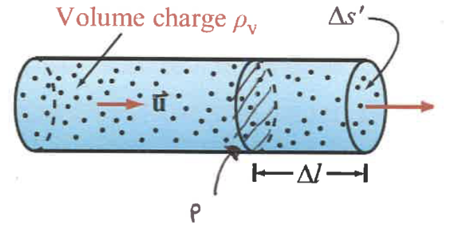

# Magnetostatics

## Current Density

$\Delta l = |\vec{u}| \Delta t$

The charge inside the volume moved $\Delta l$ distance

$\Delta q = (\Delta l A s')\rho_v$

Current = $\frac{\Delta q}{\Delta t} = |\vec{u}| \rho_v A s'$

Current = $\int_s \vec{J} \cdot d\vec{A}$

**Continuity Equation of Current**

$$\vec{\nabla} \cdot \vec{J} + \frac{d\rho_v}{dt} = 0$$

Current density diverging from a point is the negative of the change in charge density at a point.

## Magnetic Field and Force
Moving charges produce magnetic fields and those fields exert forces on moving charges.

The force exerted by the B field on a moving charge:

$$\vec{F}_{mag} = q \vec{v} \times \vec{B}$$

on a current carrying wire:

$$\vec{F}_{mag} = \int I (d\vec{l} \times \vec{B})$$

where $d\vec{l}$ points in the direction of the current flow

Since the force points to a perpendicular direction, an electric charge moving through the B field follows a curved trajectory.

**Magnetic Field Does No Work**

The force is always perpendicular to the direction that the charge is moving toward.

