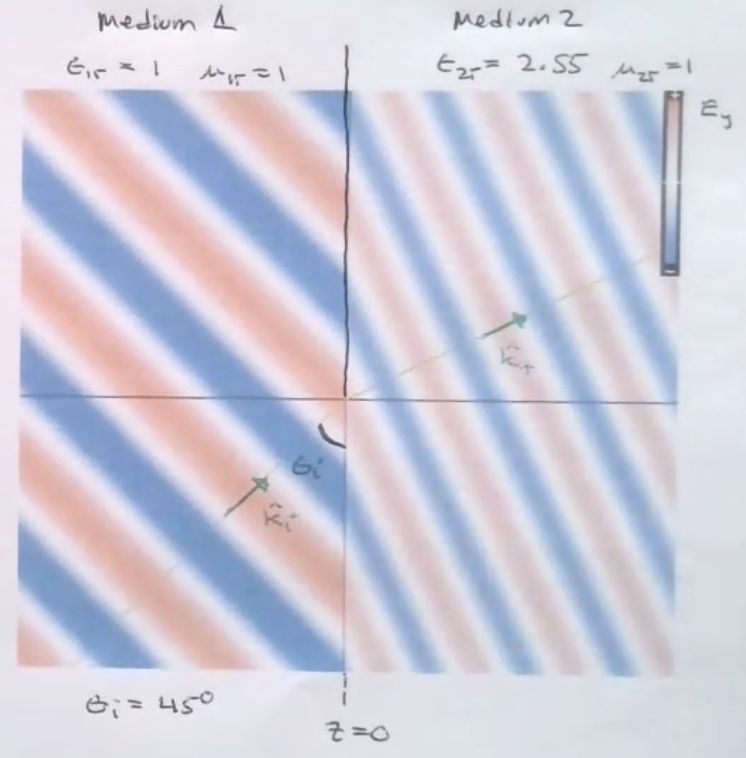
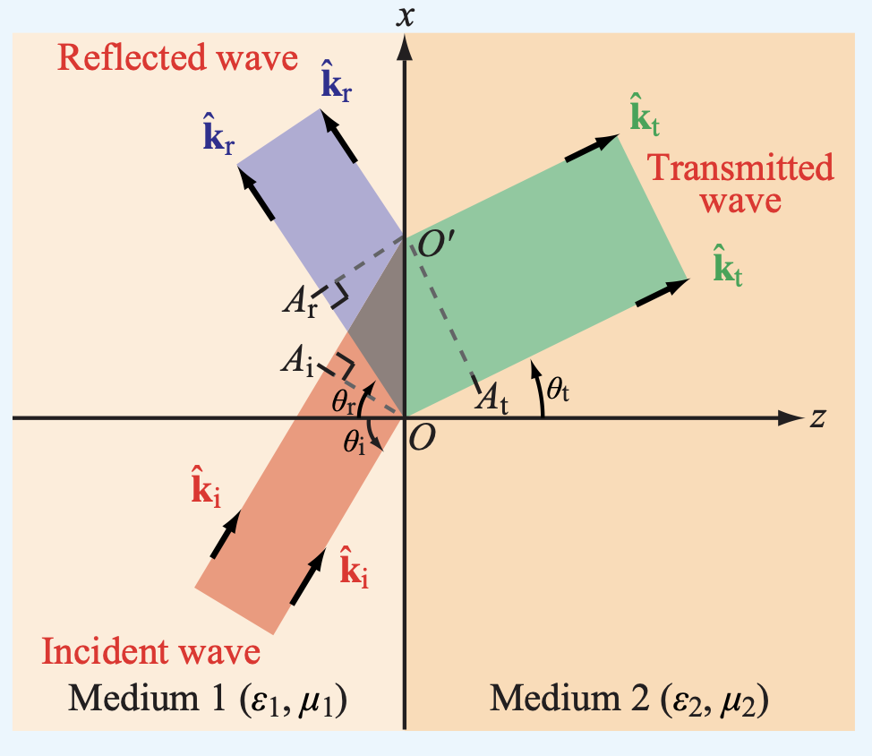

# Reflection and Transmission

This chapter goes through uniform plane EM wave reflection and transmission in the normal direction, then extends the concept to reflection in any direction.

## 1. Normal Reflection and Transmission

**Normal Incidence**: the wave vector k is **perpendicular** to the surface of the materials' boundary. 

Assume that we have a uniform plane wave traveling in the z direction and passing from medium 1 to medium 2

To find out the reflection and refraction behavior of EM waves, we need to use the boundary condition of the E and H fields.

| | Incident | Reflected | Transmitted |
|---:| ---:|---:|---:|
| E Field | $\widetilde{E}^i(z) = \hat{x} E_0 ^i e^{-jk_1 z}$ | $\widetilde{E}^ \Gamma (z) = \hat{x} E_0 ^\Gamma e^{jk_1 z}$ | $\widetilde{E}^T(z) = \hat{x} E_0 ^T e^{-jk_2 z}$ |
| H Field | $\widetilde{H}^i(z) = \hat{y} \frac{E_0 ^i}{\eta_1} e^{-jk_1 z}$ | $\widetilde{H}^\Gamma (z) = -\hat{y} \frac{E_0 ^\Gamma}{\eta_1} e^{-jk_1 z}$ | $\widetilde{H}^i(z) = \hat{y} \frac{E_0 ^T}{\eta_2} e^{-jk_2 z}$ |

Due to the field's boundary conditions at z = 0, the **Incident wave + Reflected Wave = Transmitted Wave** at the boundary.

Therefore,

$$E_0^i + E_0 ^\Gamma = E_0 ^T$$

$$\frac{E_0 ^ i }{\eta_1} - \frac{E_0 ^ \Gamma}{\eta_1} = \frac{E_0 ^T}{\eta_2}$$

### Reflection Coefficient

$$\Gamma = \frac{\eta_2 - \eta_1}{\eta_2 + \eta_1}$$

### Transmission Coefficient

$$\tau = \frac{2\eta_2}{\eta_2 + \eta_1}$$

In addition,

$$\tau = 1 + \Gamma$$

Notice that the result is the same as those from the transmission line if we replace the intrinsic with characteristics impedance.

The transmission line could be thought of as a 1D EM Wave traveling from medium to medium.

### Power Flow in Reflection and Transmission

Power flow in medium 1

$$\vec{S}_{av} = \Big(\frac{|E_0^i|^2}{2 \eta_1} - |\Gamma|^2 \frac{|E_0^i|^2}{2 \eta_1} \Big)\hat{z}$$

Note that the $-\hat{z}$ component is the power carried by the reflected wave.

Power flow in medium 2

$$\vec{S}_{av} =|\tau|^2 \frac{|E_0^i|^2}{2 \eta_2} \hat{z}$$

## 2. Oblique Reflection and Transmission

The **refractive index** is defined as

$$n = \sqrt{\epsilon_r \mu_r}$$

Recall that the speed of EM wave propagation is $V_p = \frac{1}{\sqrt{\epsilon_r \epsilon_0 \mu_r \mu_0}}$, we can rewrite it as 

$$V_p = \frac{c}{n}$$

and for the wavelength

$$\lambda = \frac{\lambda_0}{n}$$

**What Happens When the Incident Wave Comes at an Angle?**

**Expectation 1:** The transmitted wave must travel at a different angle.

That's because the wave should have a shorter wavelength in medium 2, resulting in shorter peaks and troughs. For the length of the peaks and troughs to match up at the boundary, the medium 2 wave must be at a **different angle** \since its peaks and troughs are shorter.

**Expectation 2:** The orientation of the E field affects the oblique incidence. Notice that in the reflection below, the E field can point in the y direction (out of the page) or the x-z direction (in the plane). The out-of-page scenario is called the **perpendicular polarization** and the other is the **parallel polarization** because E fields point in different directions (different polarization).

### Reflection and Transmission Angle

$$\theta_i = \theta_r$$

$$\frac{\sin \space \theta_t}{\sin \space \theta_i} = \frac{n_1}{n_2}$$

When the transmission angle $\theta_t$ is undefined, we have a total internal reflection.

### Transverse Electric Reflection and Transmission

The following reflection and transmission coefficient applies when the E field of the EM wave is perpendicular to the reflection plane (out of the page).

$$\Gamma_{\perp} = \frac{\eta_2 \space \cos\space \theta_i - \eta_1 \space \cos \space \theta_t}{\eta_2 \space \cos \space \theta_i + \eta_1 \space \cos \space \theta_t}$$

$$\tau_{\perp} = \frac{2 \eta_2\space \cos\space \theta_i}{\eta_2 \space \cos \space \theta_i + \eta_1 \space \cos \theta_t}$$

The reflection and transmission coefficients are related by

$$\tau_{\perp} = 1 + \Gamma_{\perp}$$

### Transverse Magnetic Reflection and Transmission

The following reflection and transmission coefficient applies when the E field of the EM wave is parallel to the reflection plane (in the page).

$$\Gamma_{\parallel} = \frac{\eta_2 \space \cos\space \theta_t - \eta_1 \space \cos \space \theta_i}{\eta_2 \space \cos \space \theta_t + \eta_1 \space \cos \space \theta_i}$$

$$\tau_{\parallel} = \frac{2 \eta_2\space \cos\space \theta_i}{\eta_2 \space \cos \space \theta_t + \eta_1 \space \cos \theta_i}$$

$$\tau_{\parallel} = (1 + \Gamma_{\parallel})\frac{\cos \space \theta_i}{\cos \space \theta_t}$$

**The tangential component of the incident, reflected, and transmitted electric field should be in the same direction.**

### Brewster's Angle

The Brewster's Angle is the incident wave angle that results in no reflection of the incident wave, and it's different for the parallel and perpendicular polarizations of the Electric field.

**Parallel Polarization**
$$\tan \space \theta_B = \sqrt{\frac{\epsilon_2}{\epsilon_1}}$$

**Perpendicular Polarization**

$$\sin \space \theta_B = \sqrt{\frac{1-\Big( \frac{\mu_1 \epsilon_2}{\mu_2 \epsilon_1}\Big)}{1- \Big( \frac{\mu_1}{\mu_2}\Big)^2}}$$

### Total Internal Reflection

$$\theta_t = 90 ^ \circ\$$

$$\sin \space \theta_t = \frac{n_1}{n_2} \sin \space \theta_i$$
$$\implies \sin \space 90^\circ = \frac{n_1}{n_2} \sin \space \theta_i$$
$$\implies 1 = \frac{n_1}{n_2} \sin \space \theta_c$$

$\theta_c$ is the critical angle that causes total internal reflection

## 3. Multiple Interfaces

When a wave travels from one medium to another medium, its wavelength and phase velocity change.

At normal incidence, this reflection and transmission problem maps directly to the transmission line and forms a standing wave with the incidence wave.

If we extend the idea of shrinking the transmission line into a lumped circuit element, we have:

$$\eta(d) = \frac{\widetilde{E}_{x}}{\widetilde{H}_y} = \eta_2 \Bigg( \frac{\eta_0 + j \eta_2 \tan k_2 d}{\eta_2 + j \eta_0 \tan k_2 d}\Bigg)$$

When a transmission line is infinite without bound, it could be seen as a lumped impedance equal to the characteristic impedance because an infinite transmission won't have a reflection.

