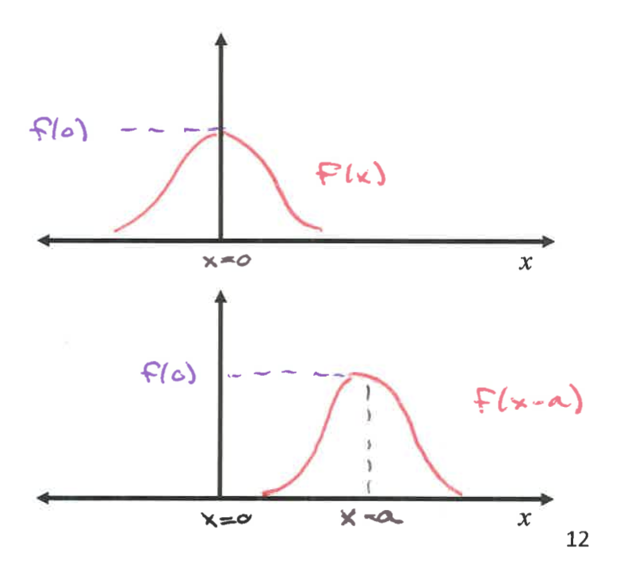
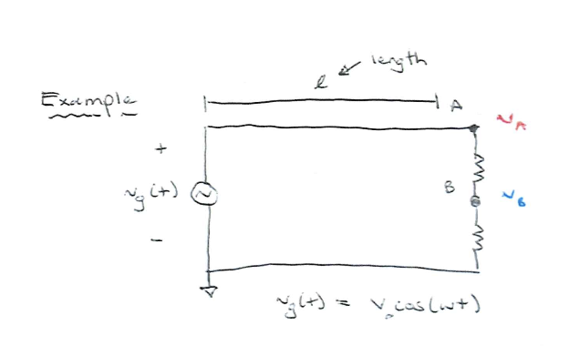

# Transmission Line

## Wave Basics
* **Waves are disturbances that propagate**
* However, the voltage waveform we observed in Circuit 1 doesn't take into account of the propagation of wave across physical space.

### Circuit Theory's Voltage Wave
$$V(t) = Acos(\omega t + \phi)$$
, where $A$ is the amplitude and $\phi$ is the phase.

### Physical 1-D Wave
$$
y(x, t) = Acos(\frac{2\pi}{T}t - \frac{2\pi}{\lambda}x+\phi) \\
= Acos(\omega t - \beta x + \phi)\\
$$

, where $A$ is the amplitude, $T$ is the period, $\lambda$ is the wavelength, and $\phi$ is the phase.

### Direction of the wave

Notice that if we fix $x$ and change $t$, we shift the wave across location.

$$
y(x, t) = Acos(\omega t - \beta x + \phi)\\
= Acos(-(\beta x - \omega t)) \\
= Acos(-\beta(x - \frac{\omega}{\beta}t))\\
$$

### Phase Velocity
Since the wave function is right shifted x unit by $\frac{\omega}{\beta}t$ 

after a time $\Delta t$,

$$
\Delta x = \frac{\omega}{\beta}\Delta t \\
v_p = \frac{\Delta x}{\Delta t} = \frac{\omega}{\beta} = \lambda f
$$
, where $v_p$ is the phase velocity.

## Luped-Element Circuit Model
When to use it?

If $\frac{l}{\lambda} < \frac{1}{100}$, we can use the lumped-element model.

## Distributed Circuit

We need to account for spatial variation if $\frac{l}{\lambda} \geq \frac{1}{100}$

To analyze this big distributed circuit, we could partition the wire into small chunks, $\Delta z$.

Moreover, these $\Delta z$ won't just be wire. They are **coaxial cable** with resistance, inductance, and capacitance, so we need an accurate circuit to model it.

### KVL

$$
\begin{align}
& v(z+\Delta, t) = v(z, t) + v' \\
& \implies v(z, t) - i(z, t)R - L\frac{di(z, t)}{dt} \\
& \implies v(z + \Delta z, t) - v(z,t) = -R'\Delta z \space i(z, t) - L' \Delta z \frac{di(z, t)}{dt} \\ 
& \implies \frac{v(z + \Delta z, t)}{\Delta z} = -R' \space i(z,t) - L' \frac{di(z, t)}{dt} \\
& \implies \frac{\partial v(z, t)}{\partial z} = -R' \space i(z, t) - L'\frac{\partial i(z, t)}{\partial t}
\end{align}
$$

### KCL