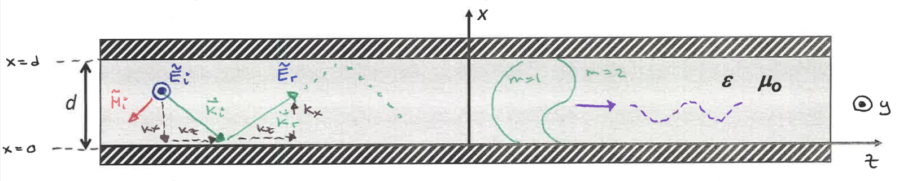
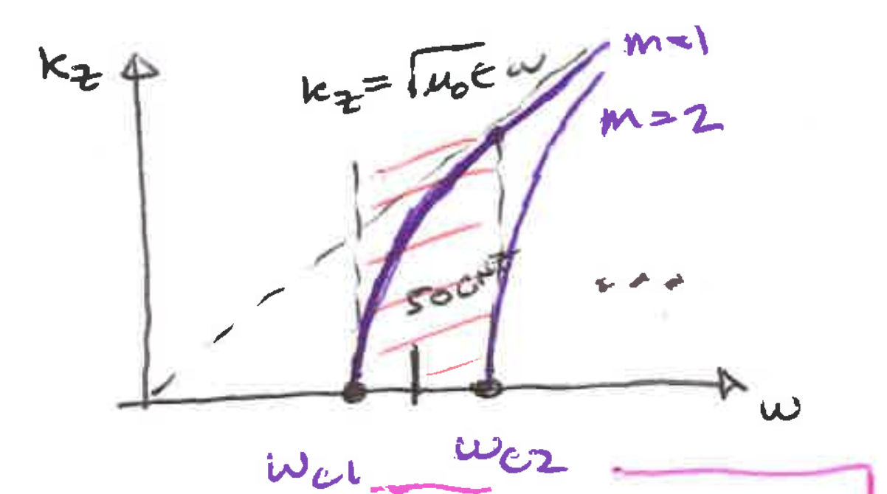
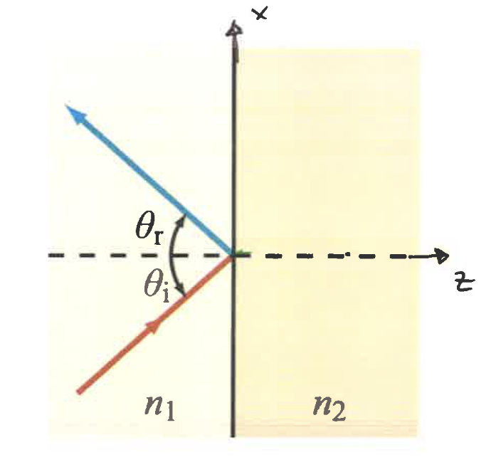
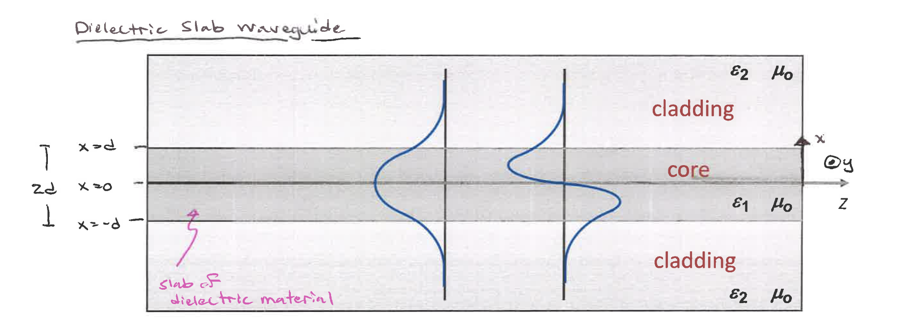

## Parallel Plate Waveguides

If we have an EM wave incident on a perfect conductor, $\Gamma = -1$ regardless of the incident angle.

Therefore, we can use two metallic plates to build a waveguide that guides the direction of the wave.

Depending on the polarization of the electric field, there will be different solutions to wave in the waveguide.

### Transverse Electric (TE) Mode

Consider a plane wave reflecting from the bottom conductor of a parallel-plate waveguide. The plane wave is perpendicularly polarized - its component is perpendicular to the direction of propagation.

The total wave is

$$\bold{\widetilde{E}}(x, z) = \bold{\widetilde{E}_i} + \bold{\widetilde{E}_r}$$

$$= \hat{y} E_0 ^i e^{-j(-k_x x + k_z z)} + \hat{y} \Gamma E_0 ^i e^{-j(k_x x + k_z z)}$$

$$= \hat{y} E_0 ^i (e^{j(k_x x)} - e^{-j(k_x x)}) e^{-jk_z z}$$

Using Euler's Identity

$$= \hat{y} E_0 ^i (2 j \sin(k_x x))e^{-jk_z z}$$

If the distance between the metallic plates is d, $\sin(k_x x) = 0$ because the perpendicular E field must be 0 at the boundary, so $k_x d = m \pi$ 

The electric field phasor of EM wave traveling toward z inside a perfectly conducting waveguide becomes:

$$\bold{\widetilde{E}(x, z)} = \hat{y} E_{0}^i \sin \Big(\frac{\pi m}{d} x \Big) e^{- j k_z z}$$

where m is any positive integer.

Notice that if we fix z, we have a standing wave across x. If we fix x, we have a wave traveling toward +z.

The phasor forms a grid-like pattern moving toward +z. When two metallic plate waveguides are placed at the axis, the wave doesn't exist outside of the waveguide. 

**Dispersion**

$$k_x ^2 + k_y ^2 + k_z ^2 = \epsilon \mu_0 \omega ^2$$

$$(\frac{m \pi}{d})^2 + k_z ^2 = \epsilon \mu_0 \omega^2$$

We can rearrange the equation above into:

$$k_z = \sqrt{\mu_0 \epsilon \omega^2 - (\frac{m \pi}{d})^2}$$

The cut-off frequency occurs when $k_z = 0$

$$\omega_{cm} = \frac{1}{\sqrt{\mu \epsilon}} \frac{m \pi}{d}$$

* Attenuation: $\mu_0 \epsilon \omega^2 < (\frac{m \pi}{d})^2$ means $k_z$ is imaginary and there's loss.
* The single mode regime must be between $\omega_{c1}$ and $\omega_{c2}$.

### Transverse Magnetic (TM) Mode

The magnetic field is perpendicular to the plane of propagation and the E field is in parallel to it. The TM Mode has a similar wave solution to that of the TE mode, and the dispersion relation is identical.

$$\bold{\widetilde{E}}(x, z) = \frac{-j H_0}{\omega \epsilon}(-\hat{z} \frac{m \pi}{d} \sin\Big(\frac{m \pi}{d}x\Big) + \hat{x} j k_z \cos\Big(\frac{m \pi}{d}x\Big))e^{-j k_z z}$$

where m is any positive integer, including 0.

At m = 0,

$$\bold{\widetilde{E}}(x, z) = \hat{x} \eta H_0 e^{-j k_z z}$$

The m = 0 solution is special such that it only exists for TM mode because TM mode is related to cosine, which is not zero at m = 0.

## Rectangular Waveguides

The parallel-plate waveguide is not realistic because it's infinite in one dimension. Therefore, we will look at the rectangular waveguides, where the wave is confined in the x and y directions.

$TM_{mn}$
$$\widetilde{E}_z = E_0 \sin\Big(\frac{m \pi}{a}x\Big) \sin\Big(\frac{n \pi}{b}y \Big) e^{-jk_z z}$$

$TE_{mn}$

$$\widetilde{E}_x = E_{0x} \cos\Big(\frac{m \pi}{a}x\Big) \sin\Big(\frac{n \pi}{b}y \Big) e^{-jk_z z}$$

$$\widetilde{E}_y = E_{0y} \sin\Big(\frac{m \pi}{a}x\Big) \cos\Big(\frac{n \pi}{b}y \Big) e^{-jk_z z}$$

**Dispersion Relation**

$$(\frac{m \pi}{a})^2 + (\frac{n \pi}{b})^2 + k_z ^2 = \epsilon \mu \omega^2$$

When $k_z = 0,$

$$\omega_{cut-off \space m, n} = \frac{1}{\sqrt{\mu \epsilon}} \sqrt{(\frac{m \pi}{a})^2 + (\frac{n \pi}{b})^2}$$

The impedance that relates the magnetic and electric phasor.

<!-- Change -->
$$Z_{TM} = \frac{\eta}{\sqrt{1-(\frac{f_{cut-off}}{f})^2}}$$

## Dielectric Slab Wave Guide

### Surface Wave from Total Internal Reflection

The transmitted surface wave has a phase shift and decays.

Consider a reflection problem where $\sin(\theta_t) > 1$ 

The transmitted wave's wave vector is

$$\vec{k}_t = \vec{k}_x \hat{x} + \vec{k}_z \hat{z}$$

$$= |\vec{k}|(\sin(\theta_t) \hat{x} + \cos(\theta_t)\hat{z})$$

Since $\cos(\theta_t) = \sqrt{1 - \sin^2(\theta_t)}$ and $\sin(\theta_t) > 1$, $\cos(\theta_t) = -j a_z$

$$\vec{k}_t = k_x \hat{x} + -j a \hat{z}$$

As a result, the wave will look like $e^{- j k_x x - a z}$, which has a decaying factor

Furthermore, we will find that

$$\bold{\Gamma = 1}$$

<!-- Evanescent Wave -->

$\bold{\widetilde{E}}$ in $\epsilon_1$

$$\bold{\widetilde{E}} = \hat{y} E_0 ^ i e^{-j(-k_x x + k_z z)} + \hat{y} \Gamma E_0 ^ i e^{-j (k_x x + k_z z)}$$

$\bold{\widetilde{E}}$ in $\epsilon_2$

$$\bold{\widetilde{E}} = \hat{y} \tau E_0 ^ i e^{-j (j a_x x + k_z z)}$$

<!-- The Solution after applying boundary condition -->

